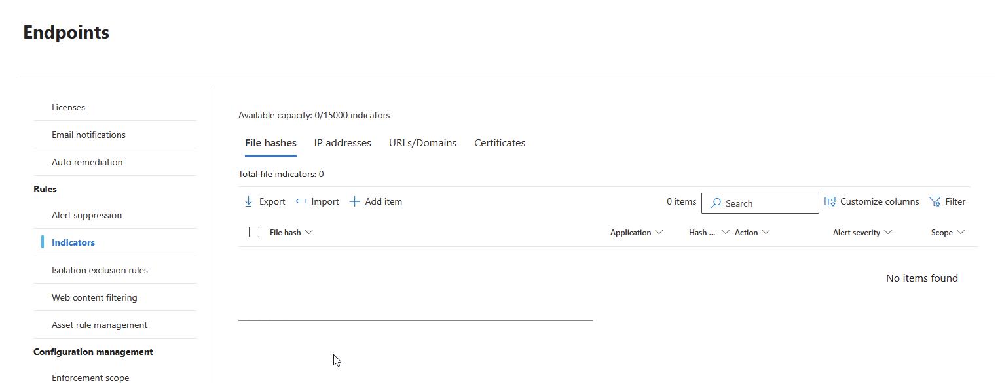
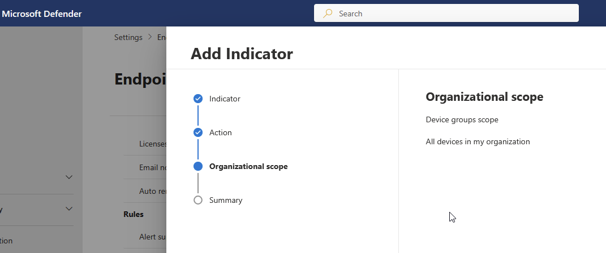
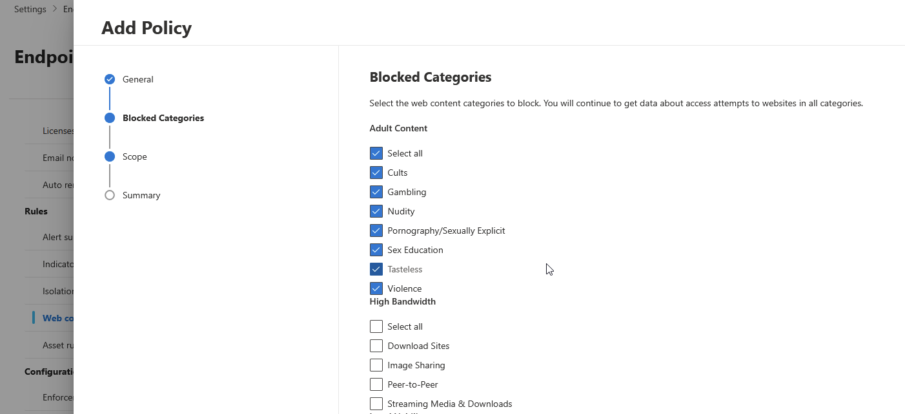
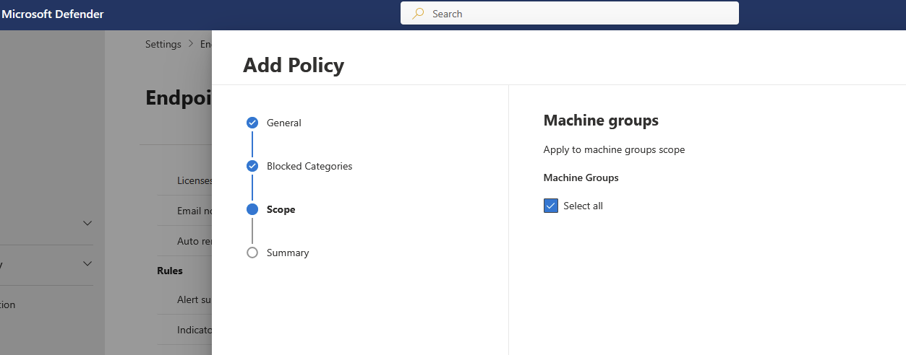

This is my summary experience for blocking specific URLs in MS365.

The first thing you may have to decide a suitable method for your situation and environment because there are 2 method as the followings:
1. Devices based
    1.1 Using MDE (Microsoft Defender for Endpoint), with the web content filtering or indicators you can block or allow any **onboarded devices** from accessing application, URLs, Domain, IP addresses as shown below.
        However, you need the applicable license (not sure at the moment) to be able to select specific devices to apply the policy. If you don't have the proper license, you can still apply the "Indicator" or "Web content filtering" to all devices only.
   
<b>Indicator</b>    

<b>Web content filtering</b>

   
2. Users based

Reference:
https://www.anoopcnair.com/block-urls-on-google-chrome-and-microsoft-edge/
